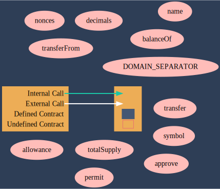

# Audits

# A collective ownership platform for NFTs on Ethereum

Below is a "Call Graph" of the NFT. This call graph shows the Transfer functions within the `TransferRefernce.sol` file. 

* The `ERC20Transfer` has an internal call that points to an abstract `IERC20` contract
* `ERC721 TransferFrom` has an internal call that points to an abstract `IERC721` contract
* `ERC1155TransferFrom` & `ERC1155BatchTransferFrom` both point to an abstract `IERC1155` contract.

# Transfer Refrences Graph

## A call to a user-supplied addres is executed 

 ### Re-entrancy [SWC-107](https://swcregistry.io/docs/SWC-107)
 
  * An external message call to an address specified by the `caller` is executed. Note that the `callee` account might contain arbitrary code and could re-enter any function within this contract. Reentering the contract in an intermediate state may lead to unexpected behaviour.

### Requirement violation [SWC-123](https://swcregistry.io/docs/SWC-123)

* A requirement was violated in a nested call and the call was reverted as a result. 

https://github.com/Keen-Sheen/Audits/blob/d94043fbc734e0e8bddd29b6888587ec00224954/src/interfaces/IERC20.sol#L41

# IERC20 Graph

The `IERC20` contract is an abstract contract. The ERC20Transfer contract points directly to the IERC20 contract.

# Prevention

To solve the issues found above the developer should consider the following:

* Make sure valid inputs are provided to the nested call (for instance, via passed arguments)

* Make sure all internal state changes are performed before the call is executed. This is known as the Checks-Effects-Interactions pattern

* Use a reentrancy lock (ie. OpenZeppelin's ReentrancyGuard https://github.com/OpenZeppelin/openzeppelin-contracts/blob/master/contracts/security/ReentrancyGuard.sol
