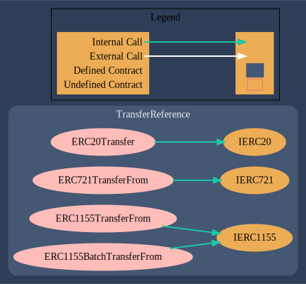

# Audits

# A collective ownership platform for NFTs on Ethereum

Below is a "Call Graph" of the NFT. This call graph is showing the Transfer functions within the `TransferRefernce.sol` file. 

* The `ERC20Transfer` has an internal call that points to an abstract `IERC20` contract
* `ERC721 TransferFrom` has an internal call that points to an abstract `IERC721` contract
* `ERC1155TransferFrom` & `ERC1155BatchTransferFrom` points to an abstract `IERC1155` contract.

## A call to a user-supplied addres is executed

  * An external message call to an address specified by the `caller` is executed. Note that the callee account might contain arbitrary code and could re-enter any function within this contract. Reentering the contract in an intermediate state may lead to unexpected behaviour. 

https://github.com/Keen-Sheen/Audits/blob/d94043fbc734e0e8bddd29b6888587ec00224954/src/interfaces/IERC20.sol#L41
